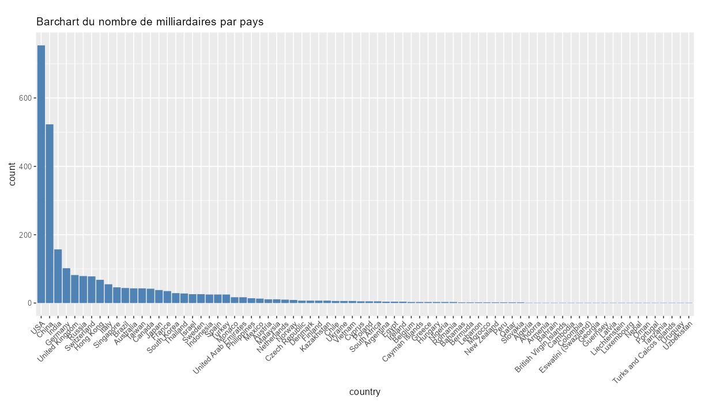
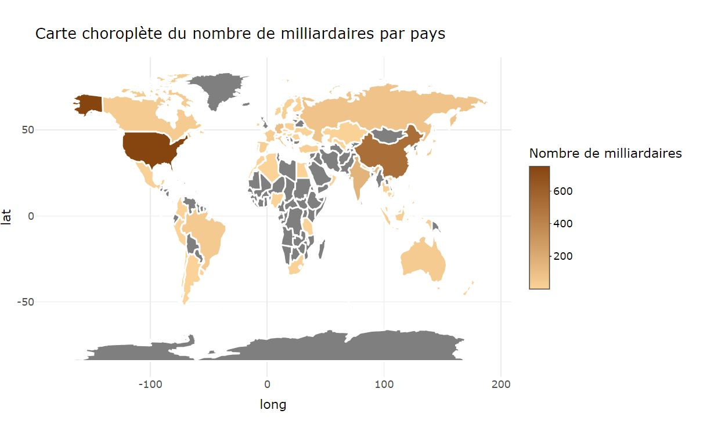
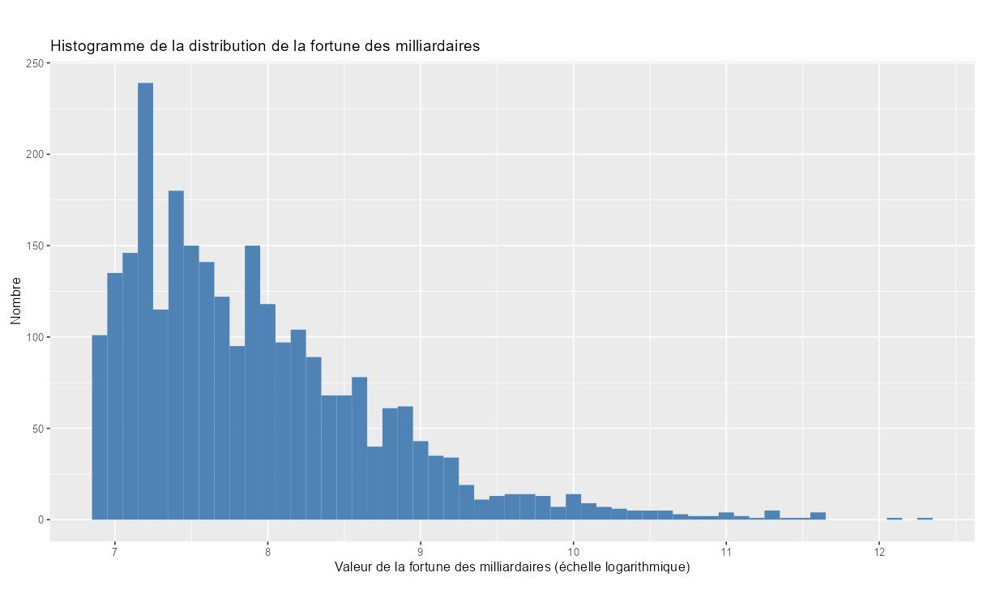
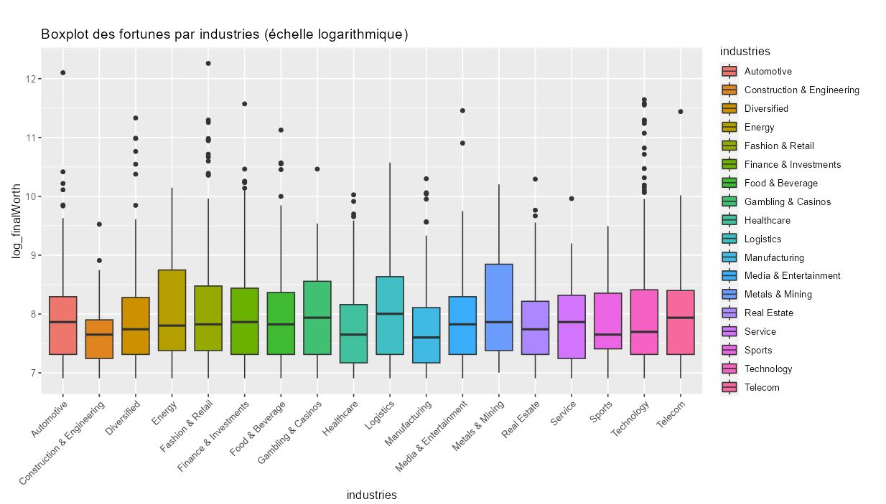
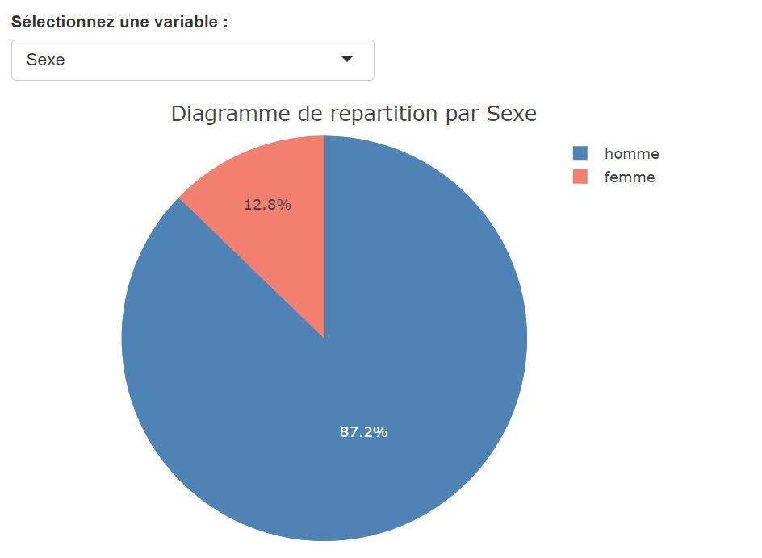
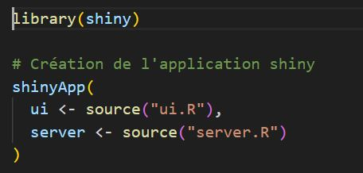
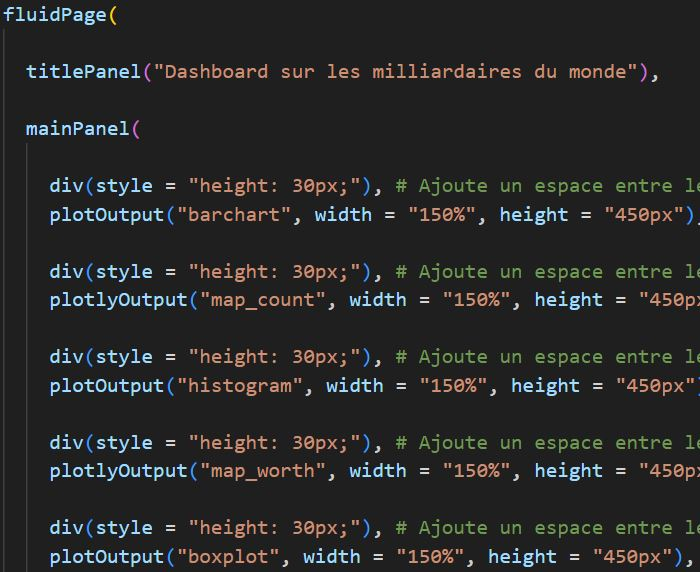
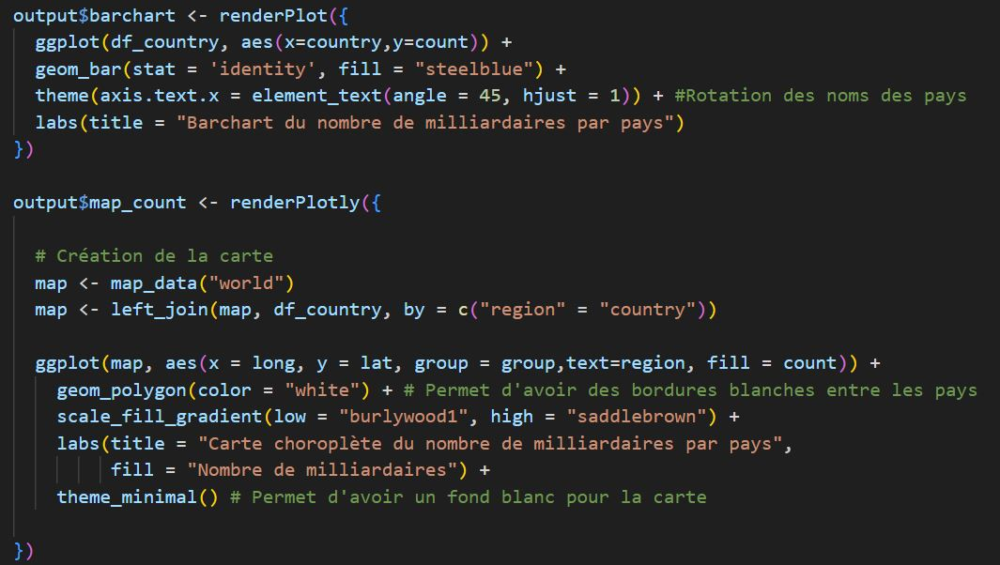
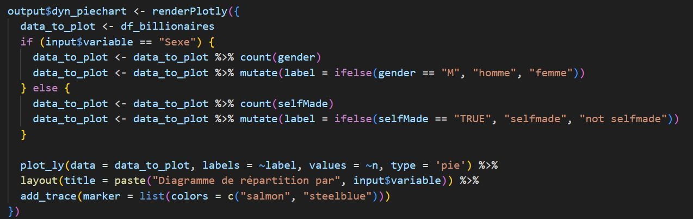
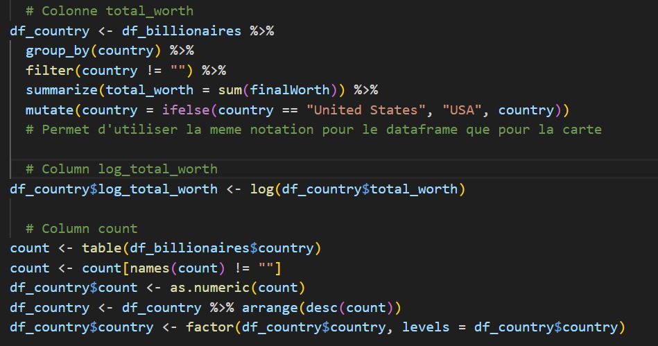

#Notice d'utilisation de l'application Shiny sur les milliardaires

Cette application a pour but de collecter des informations sur les individus les plus fortunés du monde. De plus, son objectif est de présenter visuellement ces données de manière précise et conviviale sur le site.
Le projet est disponible ici: https://git.esiee.fr/texiera/projet-e4-r

###Guide de l'utilisateur

**Mise en route**:
Premièrement, télécharger l'ensemble des fichiers du projet. Il faut ensuite lancer Rstudio, et créer un nouveau projet Shiny en ouvrant le répertoire qui contient les fichiers du projet. Ouvrez le fichier requiremens.txt pour connaître les packages à installer. Pour chaque package "package_name" présent dans le fichier, effectuer la commande: install.packages("package_name"). Pour démarrer le projet, il faut compiler le fichier **app.R**. Une fenêtre s'ouvre avec l'ensemble du dashboard.

**Architecture du site:**
Le site comporte six graphiques différents. Ils se succèdent les uns les autres. Le premier est un diagramme en barre, le deuxième et le quatrième sont une carte, le suivant est un histogramme, après il y a un box plot et un diagramme circulaire.

###Analyse de données

Premièrement, le jeu de données sélectionné provient de : https://www.kaggle.com/datasets/nelgiriyewithana/billionaires-statistics-dataset.

Le jeu de données renseigne **2640 milliardaires** les plus riches à travers le monde. Pour chacune de ces personnes, nous avons les informations suivantes:
>rang, fortune, industrie, nom de la personne, age, pays, sexe, entreprise etc ...

Dans un premier temps, analysons les statistiques descriptives de ce jeu de données.

**moyenne:** 
| fortune (Mds $) | âge          
| :--------------- |:---------------:
| 4.623 |   65  

On observe que la moyenne de la fortune de ce jeu de données est de **4.6 Mds &#36;**.
Cette donnée seul n'indique rien, cependant l'écart type de cette donnée est de 9.8. Ce qui indique que le jeu de donnée est à la fois disparate par exemple la fortune maximale atteint **211 Mds de &#36;**. La médiane de la fortune s'élève à 2.3 Mds de &#36;. Ces caractéristiques montre que la distribution de la richesse est bien plus importe pour les "_faibles_" valeurs. Ce qui indique que les valeurs extremement élevées sont relativement peu nombreuses.

En ce qui concerne l'âge, la moyenne est relativement élevé: 65 ans. Dans ce cas, la médiane et la moyenne se confondent. De plus, l'écart type vaut 13.3. À priori ces résultats ne sont pas étonnants, les milliardaires sont dans la plupart du temps des gens ayant une expérience professionelle assez longue et riche pour pouvoir accumulé ce montant d'argent. Cependant, il existe des valeurs extrèmes intéressantes à souligner. En effet, le plus jeune milliardaires a 18 ans. Au contraire, le milliardaire le plus agé a 101 ans.
On en conclut que la population des milliardaires est une population avec une majorité de senior.

**Données visualisables:**

**Graphique en barre qui montre le nombre de milliardaires par pays:**
Pour le graphique en barre, on voit que les Etats-Unis acceuillent énormément de milliardaires (plus de 800) dans les autres pays. Le podium de tête est composé des USA,Chine et l'Inde. On entrevoit une corrélation assez évidente entre les pays les plus fortunés de la planète et le nombre de milliardaire pour ces pays. 

**Carte qui illustre le nombre de milliardaires pour chaque pays:**
En ce qui concerne la première carte, il s'agit des mêmes données que le diagramme en barre précédent mais présenté de manière différente. L'avantage de la carte, c'est qu'elle est plus lisible d'un coup d'oeil pour comprendre que les milliardaires sont quasiment sytématiquement issus des pays dits "développés".

**Histogramme qui détaille la répartition des richesses des milliardaires:**
L'histogramme suivant présente la distribution de la richesse des milliardaires avec une échelle logarithmique. La nature de la distribution est poarticulière, elle est très concentrée vers les faibles valeurs. Les personnes les plus riches de ce monde sont réelement plus riches que les autres milliardaires. 

**Boîte à moustache qui illustre la fortune moyenne des industries:**
Puis, il y a la boîte à moustache qui représente les fortunes pour chaque industrie. On remarque que, la moyenne des fortunes des industries représentées est à peu près uniforme. Cependant, certaines d'entre elle sont plus rentables que d'autres (énergie,la logistique et les métaux). 

**Diagramme circulaire qui représente la fréquence des sexes et des selfmades pour les milliardaires:**
Enfin, il y a le diagramme circulaire dynamique. Ce diagramme est accompagné d'un sélecteur qui permet d'observer la proportion d'hommes et de femmes pour les milliardaires ou la proportion de milliardaire "_selfmade_". On constate que la proportion d'homme est bien plus élevé que celle des femmes (+87%). Ce qui se traduit par une inégalité sur ce point de vue là entre les hommes et les femmes. Au sujet des selfmades, il s'agit de déterminer si les milliardaires ont hérité de l'entreprise où ils travaillent. Dans ce cas, il y a plus de 68% de selfmades. La conclusion de cette statistique n'est pas réellement pertinente car un milliardaire selfmade peut hériter de fortune colossale. Le booléen n'est pas un bon indicateur pour savoir le milieu social duquel est issu le milliardaire en question.

On peut conclure que la population des milliardaires peut être caractérisée en majorité par des hommes agés vivant dans les pays développés qui se sont construit leur richesse eux-mêmes.

###Guide du développeur

Le projet est divisé en quatre principaux fichiers **.R**. Les fichiers en question sont: global.R, ui.r, app.R et server.R.

**app.r:**
Il s'agit du fichier principal qui crée deux instances pour lancer l'application shiny, une _user-interface_ et et un _serveur_. Ce fichier charge égalment la librairie shiny, qui permet de visualiser le dashobard.

**ui.r:**

Ce fichier comporte, comme son nom l'indique, l'interface de l'utilisateur. Pour rajouter des éléments sur l'interface, il faut l'ajouter dans l'élément **mainPanel()**. On peut choisir la largeur, la hauteur de l'élément.

**server.r:**

Ce fichier s'occupe de gérer le serveur de l'application shiny. À chaque élément présent daans _ui.r_, il faut le définir dans ce fichier-ci. Pour l'intégralité des graphiques effectués, nous avons utilisé le module ggplot. 

Dans cette application, il y a un graphique dynamique. Ce graphique a été créé par le code ci-dessous. On définit un sélecteur appellé input, si sa valeur vaut "sexe" alors on affiche le diagramme de répartition des sexes. Tandis que, si sa valeur vaut "selfmade", alors on affiche la répartition des selfmades.

**global.r:**
Ce fichier est fondamentale, il contient l'ensemble des varibale à traiter. Chaque opération sr le dataset est effetué dans ce fichier et contient toute les variables globales. Pour modifier le projet, assurez-vous que chaque variable soit défini dans ce fichier.

